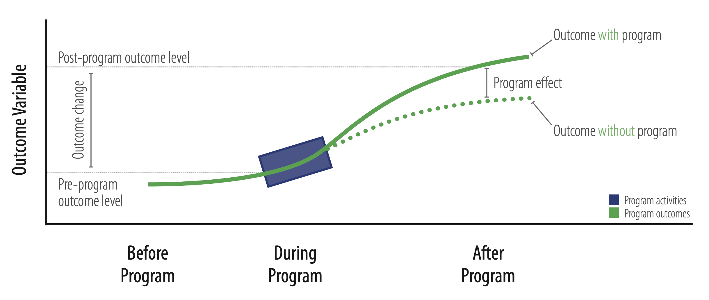
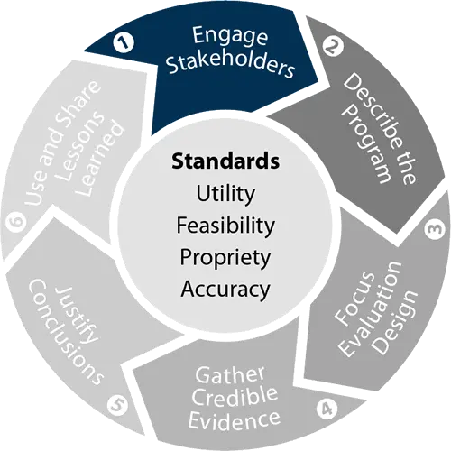
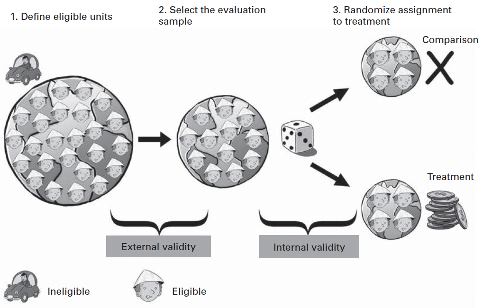
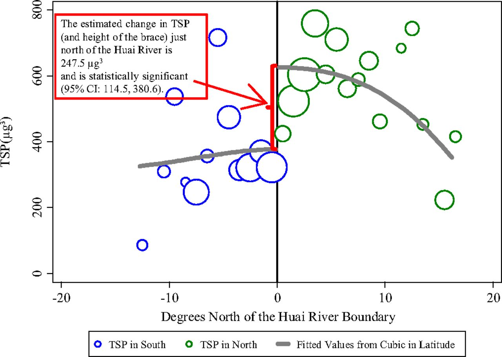
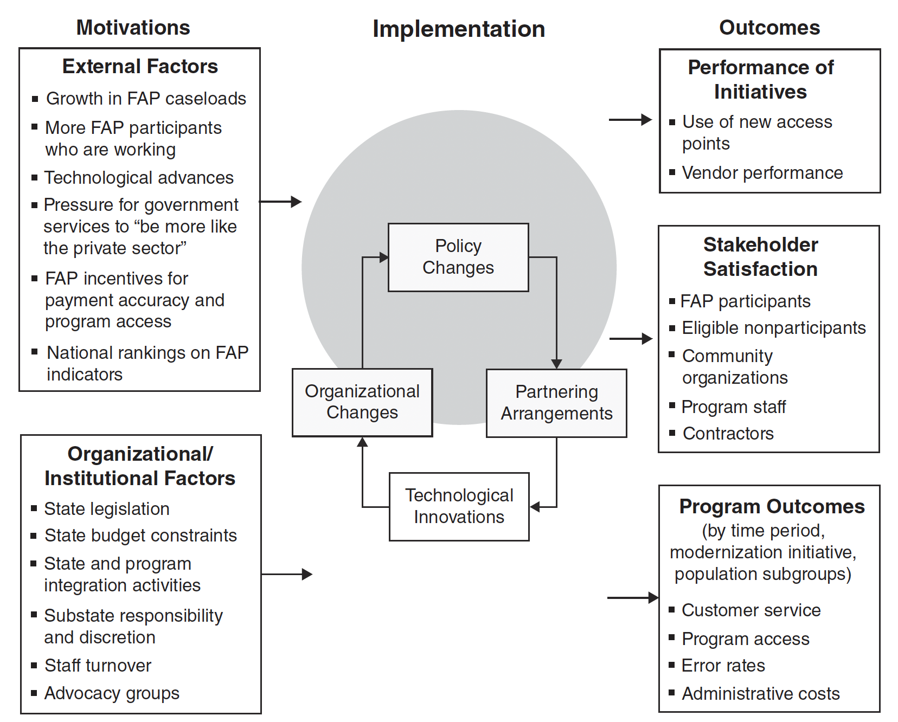
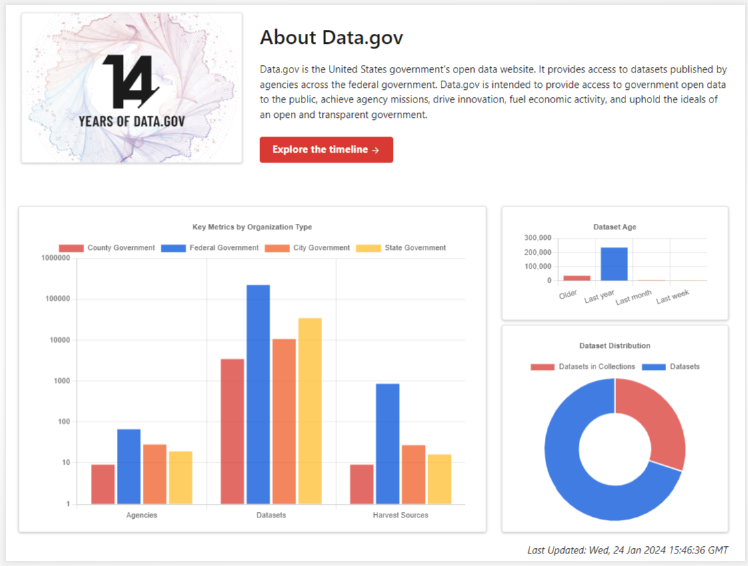
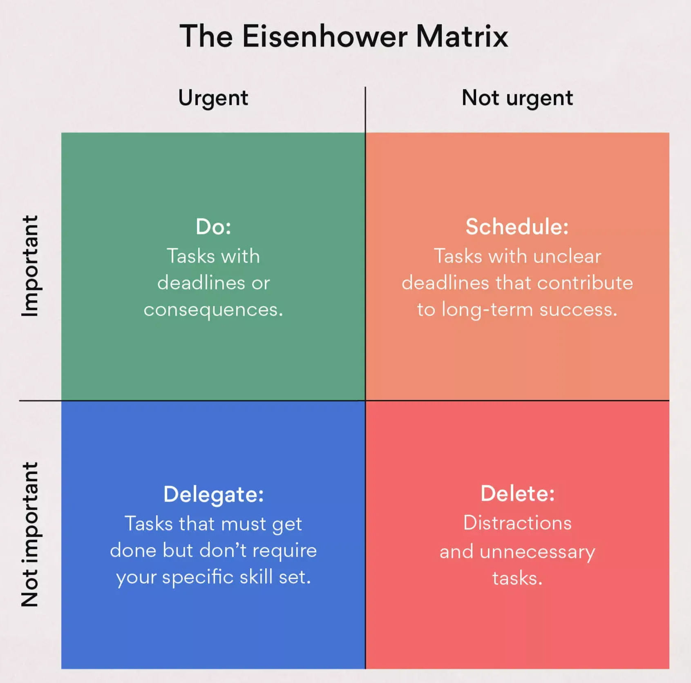
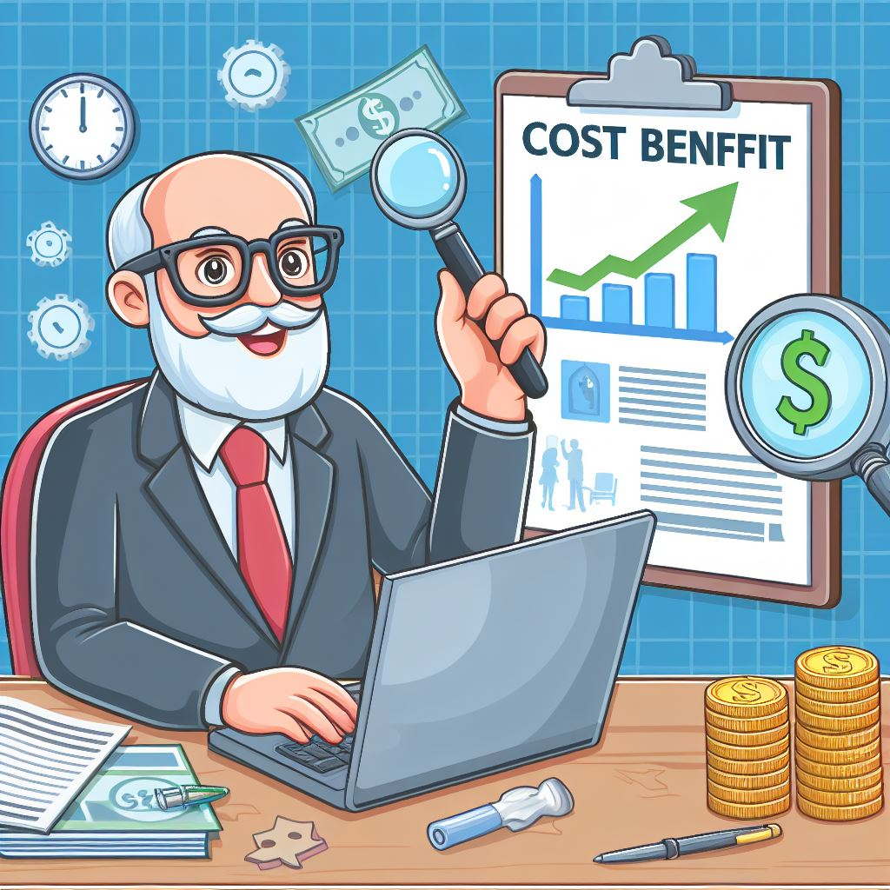

# Lectures

##### Lecture 1 Introduction

Gang He

Jan 28, 2025

##### Lecture 2 Goals and Types of Evaluation

Gang He

Feb 4, 2025

##### Lecture 3 Logic and Causal Models

Gang He

Feb 11, 2025

##### Lecture 4 Stakeholder Analysis, Mapping, and Engagement

Gang He

Feb 28, 2025

##### Lecture 5 Evaluation Designs: Randomized Experiments

Gang He

Mar 4, 2025

##### Lecture 6 Evaluation Designs: Quasi Experiments

Gang He

Mar 11, 2025

##### Lecture 7 Evaluation Designs: Qualitative Methods

Gang He

Mar 18, 2025

##### Lecture 8 Overcome Resistance and Improve Organization Capacity

Gang He

Mar 25, 2025

##### Lecture 9 Data Collection: Procedures, Instrumentation, Practical Considerations

Gang He

Apr 1, 2025

##### Lecture 10 Data Analysis: Quantitative, Qualitative, and Mixed Analysis

Gang He

Apr 8, 2025

##### Lecture 11 Economic Evaluation and Performance Measurement

Gang He

Apr 22, 2025

##### Lecture 12 Ethics, Principles, and Standards

Gang He

Apr 29, 2025
