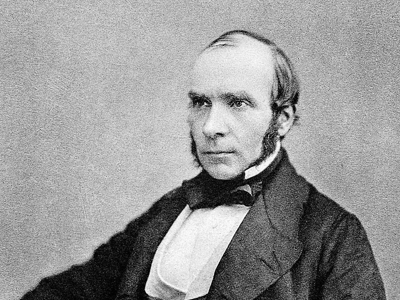
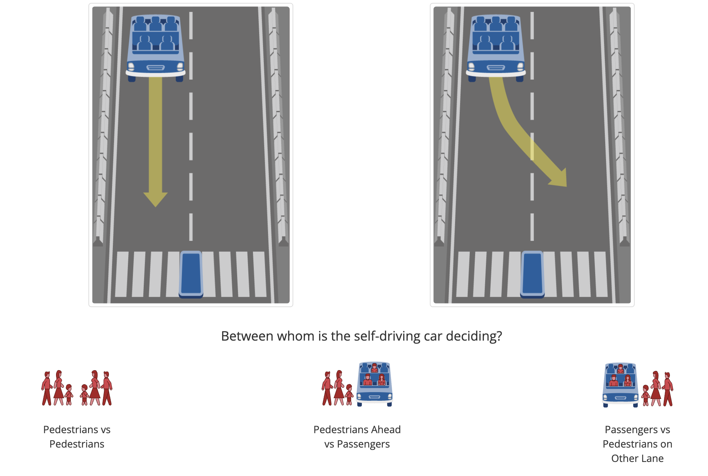
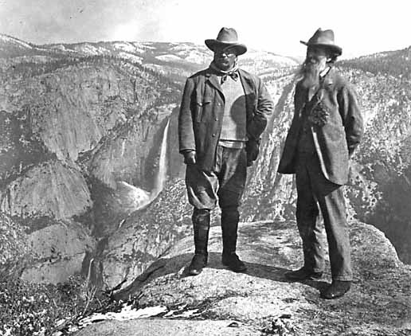

# Evaluation Stories

People, ideas, and evidence that have changed the field

##### High Line Park

Sep 8, 2026

##### John Snow and Evidence Based Analysis

Sep 2, 2026

##### The Moral Machine and Ethics

Apr 29, 2025

##### Robert Bullard and Environmental Justice

Apr 22, 2025

##### Hans Rosling, Data Visualization, and Storytelling

Apr 8, 2025

##### Feifei Li, ImageNet, and the AI Revolution

Apr 1, 2025

##### James March and Organization Theory

Mar 25, 2025

##### Elinor Ostrom and Case Studies

Mar 18, 2025

##### Michael Greenstone and Environmental Economics

Mar 11, 2025

##### Esther Duflo and Randomized Controlled Trials

Mar 4, 2025

##### John Muir and National Park System

Feb 28, 2025

##### Bombing in Vietnam – War and Development

Feb 11, 2025

##### Heating in China and Value of Clean Air

Mar 23, 2024
